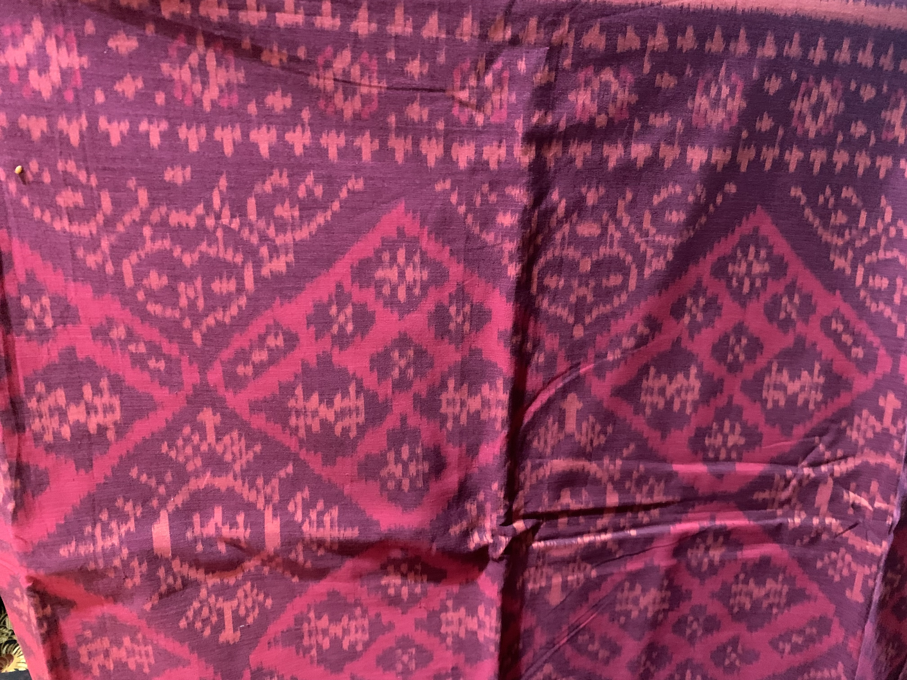
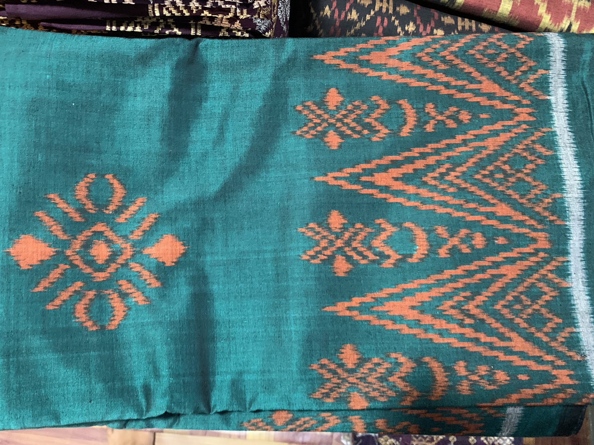
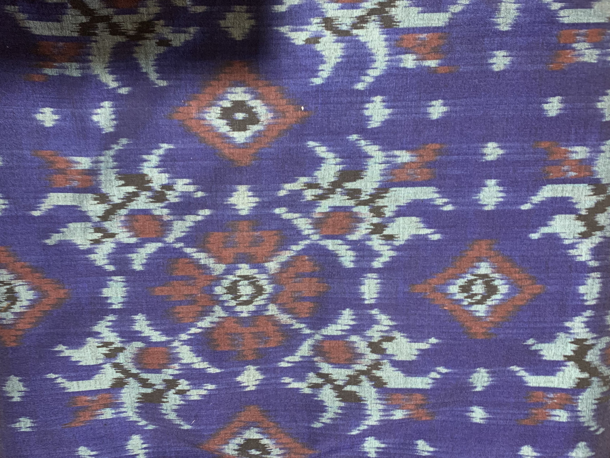
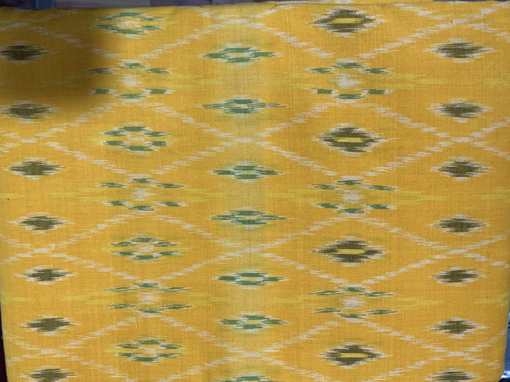
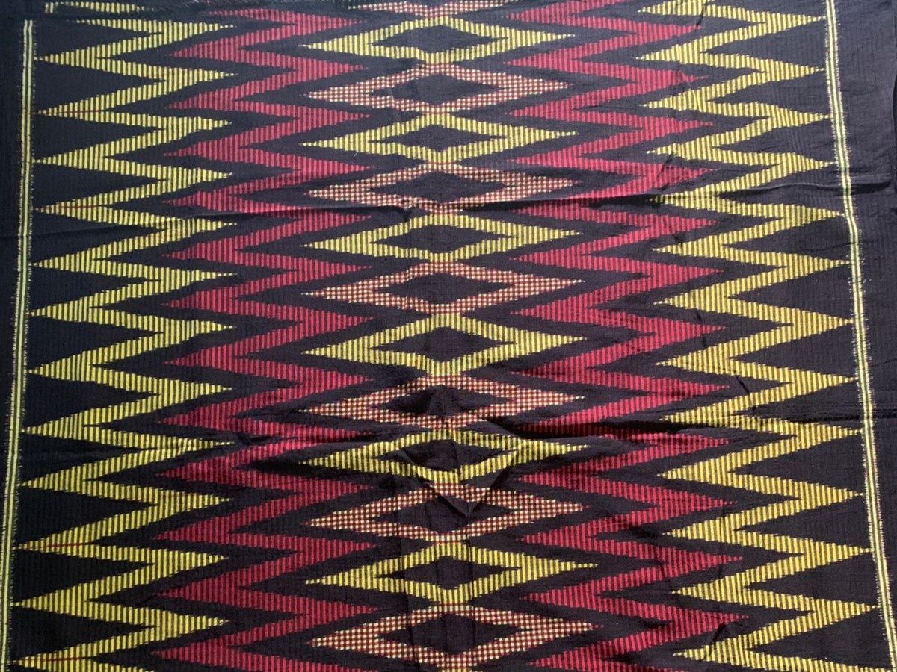
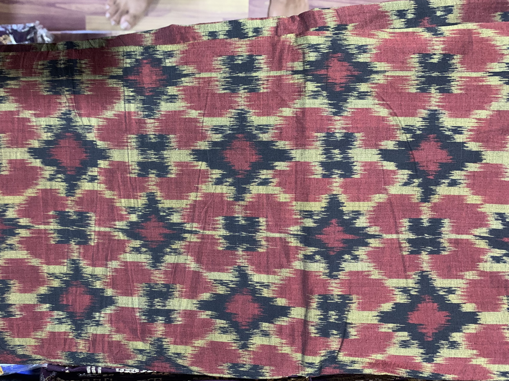

# Endek Vision App

This project features a Flutter app integrated with a machine learning model designed for image recognition. The app specifically identifies Balinese Endek fabric, leveraging advanced image classification techniques to accurately recognize and distinguish this traditional textile. Using TensorFlow Lite for model deployment, the app delivers real-time image analysis, allowing users to effortlessly identify and learn about Balinese Endek fabric through their mobile devices.

## Class

Balinese Endek is a traditional Indonesian textile known for its intricate and vibrant patterns. Originating from Bali, this fabric is characterized by its unique weaving techniques and cultural significance. The patterns are often geometric and feature symbolic motifs that reflect Balinese heritage. The model leverages these distinct types of Endek to accurately recognize and classify this traditional fabric, providing users with valuable insights and information about each pattern through the app.

In this project, the model is trained using seven distinct types of Balinese Endek fabric, which were personally collected for this purpose.

1. Endek Cakra

2. Endek Cemara

3. Endek Cempaka

4. Endek Cepuk

5. Endek Lubeng

6. Endek Rangrang

7. Endek Uang Kepeng

## Model Architecture

Initially, I used transfer learning to build the model and evaluated three different architectures: VGG16, VGG19, and MobileNetV3. After thorough testing, I selected the most effective model for implementation in this app using TensorFlow Lite. Below are the evaluation results of the models after training.

1. VGG16
   

2. VGG19

3. MobilenetV3Small

   

## APP DEMO

